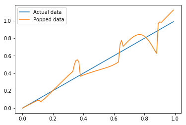

# `makeitpop`

Have you ever wanted to use a colormap like Viridis or Parula, but
keep the non-linear perceptual warping of "jet"? You're in luck!

`makeitpop` warps your data according to the same perceptual delta functions
that have been calculated for a colormap. This means that if the colormap warps
your perception of the data, so will `makeitpop`!

**NOTE: This package is for snark only.** You shouldn't use Jet precisely
because it does not accurately reflect differences in the data it represents.
This package applies the same warping, but to the data itself, in the hopes that
this illustrates what happens a bit more clearly.

```python
from makeitpop import makeitpop
import numpy as np
import matplotlib.pyplot as plt

data = np.arange(0, 1, .01)
data_more_publishable = makeitpop(data, colormap='jet')

fig, ax = plt.subplots()
ax.plot(data, data, label="Actual data")
ax.plot(data, data_more_publishable, label="Popped data")
ax.legend()
```

Outputs:


